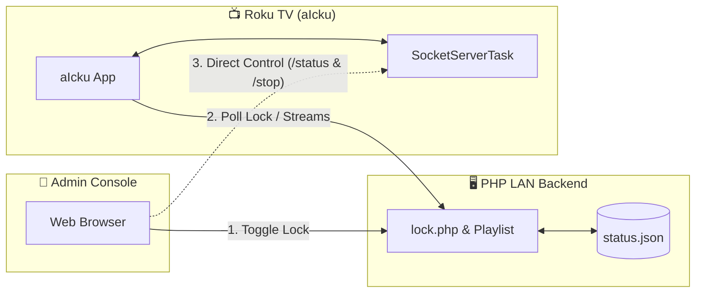

# 📺 aIcku - Roku IPTV Client & Parental Control Console

`aIcku` is a premium, custom-built IPTV client application for Roku devices, paired with a web-based local area network (LAN) Parental Control Dashboard.

Originally based on Erku, **aIcku** features a rebranded user interface, integrated local backend server, real-time device status polling, remote control/force-stop capability, and built-in Chinese font support out of the box.

---

## ✨ Features

### 🖥️ Roku Client (BrightScript/SceneGraph)
- **High-Performance IPTV Player**: Seamlessly load and play M3U streams.
- **EPG (Electronic Program Guide) Support**: Fetch and display dynamic program guides.
- **Built-in Font Support**: Pre-loaded custom fonts supporting Chinese character rendering on all screens.
- **Socket Server Task (`SocketServerTask`)**: Runs an asynchronous background socket server on the Roku client allowing local network devices to query playback status (`/status`) and command playback control (`/stop`).
- **Flexible Aspect Ratio & Overscan adjustment**: Adjust screen positioning and options directly from the settings menu.

### 🛡️ Web Control Console & Companion Backend (PHP/HTML5)
- **Glassmorphic Web Interface**: Modern, responsive dashboard with smooth gradients and interactive lock micro-animations.
- **Parental Lock Switch**: Toggle authorization state globally. When locked, the Roku client immediately blocks or cuts off streaming.
- **Real-Time TV Monitoring**: Polls the Roku client to check if it is online, what channel/program is currently playing, and displays live status on the dashboard.
- **Force Stop Command**: Instantly terminate video playback on the Roku client from your phone or PC browser.
- **EPG Endpoint**: Resolves current program information dynamically based on raw channel data.

---

## 🏗️ System Architecture

The following diagram illustrates how the `aIcku` Roku Client and the PHP Backend communicate over the local area network:



---

## 🚀 Setup & Installation

### 1. Backend Server Deployment (Docker Compose)
A `docker-compose.yml` is provided at the root of the project to quickly deploy the PHP server.

1. Put your IPTV channels list inside `backend/iptv.m3u`.
2. Ensure the host `backend/` directory is writable so PHP can read/write `status.json` for locking status.
3. Launch the container:
   ```bash
   docker compose up -d
   ```
4. The service will be accessible on port `89` (e.g., `http://<SERVER_IP>:89/index.html`). Make sure the server hosting Docker has a reachable LAN IP.

### 2. Roku App Installation (Sideloading)
To deploy the client to your Roku device:

1. Enable **Developer Settings** on your Roku device (press `Home x3, Up x2, Right, Left, Right, Left, Right` on your remote).
2. Configure your network and set a developer password.
3. Use the Roku packaging build script or compress the codebase into a `.zip` archive containing:
   - `manifest`
   - `components/`
   - `source/`
   - `images/`
   - `locale/`
4. Upload the zip package using the Roku browser installer page (`http://<ROKU_IP>`).
5. Upon the first launch, configure the Backend URL in the client settings menu to point to your hosted `lock.php`.

---

## 🛠️ Technology Stack

- **Client**: Roku SceneGraph (XML), BrightScript (BRS).
- **Backend UI**: HTML5, HSL-tailored CSS, Vanilla JS.
- **Backend API**: PHP (for local storage and file IO).

---

## 📄 License
This project is licensed under the [LICENSE](LICENSE) file included in the repository.
